# Activity Diagram — Proses Pemesanan Custom Box hingga Konfirmasi Admin Selesai
## Benua Kertas Apps

> Dokumen ini menggambarkan **Activity Diagram** lengkap alur proses pemesanan custom box oleh pelanggan, mulai dari pemilihan spesifikasi hingga admin menandai pesanan selesai diproduksi.

---

## Prompt untuk Membuat Activity Diagram

Gunakan prompt di bawah ini jika ingin membuat activity diagram menggunakan tools seperti **PlantUML**, **draw.io**, atau meminta AI untuk generate diagram:

---

### 📋 Prompt Lengkap

```
Buatkan activity diagram lengkap untuk proses pemesanan custom box pada aplikasi Benua Kertas Apps,
mulai dari pelanggan membuka halaman Custom Order hingga admin mengkonfirmasi pesanan selesai diproduksi.

Berikut detail alur prosesnya:

=== SWIMLANE ===
Terdapat 3 swimlane / aktor:
1. Pelanggan (Customer)
2. Sistem (System / Backend)
3. Admin

=== ALUR PELANGGAN — KONFIGURASI PESANAN ===
1. Pelanggan membuka halaman Custom Order (/custom-order)
2. Sistem memuat data dari API:
   - Daftar model box (GET /api/master-data/box-models)
   - Daftar material (GET /api/master-data/materials)
   - Opsi finishing/laminasi (GET /api/master-data/finishing-options)
3. Pelanggan melewati 8 langkah konfigurasi secara berurutan:

   Step 1 - Pilih Model Box:
   - Pelanggan memilih model box (misal: Regular Slotted Box, Top-Bottom Box, Earlock Box)
   - Tombol Next aktif setelah model dipilih

   Step 2 - Atur Ukuran:
   - Pelanggan memasukkan dimensi: Panjang, Lebar, Tinggi (dalam cm)
   - Jika model = Top-Bottom Box → wajib isi Tinggi Tutup
   - Jika model = Earlock Box Samping → wajib isi ukuran Lidah
   - Sistem otomatis menghitung harga sementara via API (POST /api/calculator/calculate)
     setiap kali ukuran berubah (dengan debounce 300ms)
   - Jika kalkulasi error → tampilkan pesan error, tombol Next dinonaktifkan

   Step 3 - Pilih Material & Ketebalan:
   - Pelanggan memilih jenis material (kertas)
   - Sistem mengambil opsi ketebalan (GSM) sesuai material (GET /api/master-data/materials/code/:code/thicknesses)
   - Pelanggan memilih ketebalan (GSM)
   - Tombol Next aktif setelah material DAN ketebalan dipilih

   Step 4 - Pilih Warna:
   - Pelanggan memilih opsi warna kemasan: 1 Sisi atau 2 Sisi
   - Tombol Next aktif setelah warna dipilih

   Step 5 - Pilih Finishing / Laminasi:
   - Pelanggan memilih sisi laminasi: Luar, Dalam, Luar & Dalam, atau Tanpa Laminasi
   - Jika pilihan BUKAN "Tanpa Laminasi" → wajib pilih tipe laminasi: Glossy atau Doff
   - Tombol Next aktif setelah semua pilihan finishing valid

   Step 6 - Unggah File Desain:
   - Pelanggan mengunggah file desain kemasan (format: JPG, PNG, PDF)
   - Pelanggan dapat menambahkan catatan/note tambahan
   - Tombol Next aktif setelah file berhasil diunggah

   Step 7 - Tentukan Kuantitas:
   - Pelanggan memasukkan jumlah produksi (minimal 1 pcs)
   - Sistem merecalculate harga berdasarkan kuantitas
   - Tombol Next aktif setelah kuantitas valid (>= 1)

   Step 8 - Review & Konfirmasi Spesifikasi:
   - Sistem menampilkan ringkasan semua spesifikasi yang dipilih:
     Model, Ukuran, Material+GSM, Warna, Finishing, File Desain, Kuantitas, Estimasi Produksi (20-30 hari kerja)
   - Sistem menampilkan ringkasan harga: Harga per pcs, Total Bayar, Bayar DP 60%
   - Pelanggan dapat klik tombol Edit pada setiap spesifikasi untuk kembali ke step terkait
   - Pelanggan klik "Lanjut Metode Pembayaran" → navigasi ke halaman Payment

=== ALUR PELANGGAN — PEMBAYARAN ===
4. Halaman Payment terbuka
   - Sistem menampilkan nominal DP 30% dari total harga
   - Sistem menampilkan info rekening bank tujuan transfer (BCA, Mandiri)
5. Pelanggan melakukan transfer bank manual sesuai nominal DP
6. Pelanggan mengunggah bukti transfer (foto struk / screenshot)
7. Pelanggan klik tombol "Konfirmasi Pembayaran"
8. Sistem memproses submit bukti pembayaran
9. Sistem menampilkan notifikasi sukses
10. Sistem redirect pelanggan ke halaman Profile/Order History
    - Status pesanan: "Menunggu Verifikasi"

=== ALUR ADMIN — VERIFIKASI PEMBAYARAN ===
11. Admin membuka Dashboard → Order Management
12. Admin melihat daftar pesanan masuk dengan status "Menunggu Verifikasi"
13. Admin memilih pesanan yang akan diverifikasi
14. Admin mengecek bukti transfer yang diunggah pelanggan
15. Decision: Bukti transfer valid?
    - Jika TIDAK VALID:
      → Admin menolak pembayaran
      → Status pesanan diubah menjadi "Pembayaran Ditolak"
      → Sistem notifikasi ke pelanggan
    - Jika VALID:
      → Admin menerima/approve pembayaran
      → Status pesanan diubah menjadi "Menunggu Produksi" / "Diproses"

=== ALUR ADMIN — PROSES PRODUKSI ===
16. Admin mengunduh file desain dari pesanan
17. Admin memulai proses produksi
18. Admin mengubah status pesanan menjadi "Sedang Diproduksi"
19. Proses produksi berlangsung (estimasi 20–30 hari kerja)
20. Setelah produksi selesai, Admin mengubah status pesanan menjadi "Selesai"
21. [END] Alur selesai

=== CATATAN TAMBAHAN ===
- Pada setiap step konfigurasi, pelanggan dapat menekan tombol Back untuk kembali ke step sebelumnya
- Pelanggan dapat mengedit spesifikasi pada step Review tanpa mengulang dari awal
- Kalkulasi harga bersifat real-time dan otomatis diperbarui setiap ada perubahan parameter
- Edit Mode: saat pelanggan mengedit salah satu step dari Review, setelah simpan langsung kembali ke step Review

Buat diagram dalam format PlantUML dengan swimlane, gunakan notasi UML Activity Diagram standar,
sertakan fork/join untuk aktivitas paralel (seperti API fetch saat pertama buka halaman),
dan gunakan decision node (diamond) untuk kondisi percabangan.
```

---

## Activity Diagram (Mermaid)

Berikut diagram yang dapat dirender langsung di GitHub, Notion, atau VSCode:

```mermaid
flowchart TD
    START([🟢 Mulai]) --> A1

    %% ============================================
    %% SWIMLANE: PELANGGAN - KONFIGURASI
    %% ============================================
    subgraph PELANGGAN ["👤 PELANGGAN"]
        A1[Buka Halaman Custom Order] --> A2

        subgraph LOAD ["Sistem Memuat Data Awal (Paralel)"]
            A2a[Fetch Daftar Model Box\nGET /api/master-data/box-models]
            A2b[Fetch Daftar Material\nGET /api/master-data/materials]
            A2c[Fetch Opsi Finishing\nGET /api/master-data/finishing-options]
        end
        A2[Sistem Memuat Data Master] --> LOAD

        LOAD --> A3

        %% STEP 1
        A3["📦 Step 1: Pilih Model Box\n(Regular / Top-Bottom / Earlock)"] --> D1{Model\nDipilih?}
        D1 -- Belum --> A3
        D1 -- Ya --> A4

        %% STEP 2
        A4["📐 Step 2: Input Ukuran\n(Panjang × Lebar × Tinggi)"] --> D2{Tipe Model?}
        D2 -- Top-Bottom Box --> A4a[Wajib isi\nTinggi Tutup]
        D2 -- Earlock Box Samping --> A4b[Wajib isi\nUkuran Lidah]
        D2 -- Model Lain --> A4c[Lanjut]
        A4a --> A4c
        A4b --> A4c
        A4c --> CALC[Sistem Hitung Harga Real-time\nvia API Calculator]
        CALC --> D3{Kalkulasi\nBerhasil?}
        D3 -- Error --> ERR1[Tampilkan Pesan Error\nTombol Next Nonaktif]
        ERR1 --> A4
        D3 -- Sukses --> A5

        %% STEP 3
        A5["🧾 Step 3: Pilih Material & Ketebalan"] --> A5a[Pilih Jenis Material]
        A5a --> FETCH_GSM[Sistem Fetch Opsi GSM\nGET /materials/code/:code/thicknesses]
        FETCH_GSM --> A5b[Pilih Ketebalan / GSM]
        A5b --> D4{Material &\nGSM Dipilih?}
        D4 -- Belum --> A5b
        D4 -- Ya --> A6

        %% STEP 4
        A6["🎨 Step 4: Pilih Warna\n(1 Sisi / 2 Sisi)"] --> D5{Warna\nDipilih?}
        D5 -- Belum --> A6
        D5 -- Ya --> A7

        %% STEP 5
        A7["✨ Step 5: Pilih Finishing / Laminasi"] --> A7a[Pilih Sisi Laminasi]
        A7a --> D6{Tanpa\nLaminasi?}
        D6 -- Ya --> A8
        D6 -- Tidak --> A7b[Pilih Tipe Laminasi\nGlossy / Doff]
        A7b --> A8

        %% STEP 6
        A8["📁 Step 6: Unggah File Desain"] --> A8a[Upload File JPG/PNG/PDF]
        A8a --> A8b[Opsional: Tambah Catatan]
        A8b --> D7{File\nTerunggah?}
        D7 -- Belum --> A8a
        D7 -- Ya --> A9

        %% STEP 7
        A9["🔢 Step 7: Tentukan Kuantitas"] --> A9a[Input Jumlah Produksi\nMin. 1 pcs]
        A9a --> CALC2[Sistem Recalculate Harga\nberdasarkan Kuantitas]
        CALC2 --> D8{Kuantitas\nValid?}
        D8 -- Tidak Valid --> A9a
        D8 -- Valid --> A10

        %% STEP 8 - REVIEW
        A10["🔍 Step 8: Review Spesifikasi"] --> A10a[Tampilkan Ringkasan:\nModel, Ukuran, Material, Warna\nFinishing, File, Kuantitas, Harga]
        A10a --> D9{Perlu Edit\nSpesifikasi?}
        D9 -- Ya → Edit Step --> EDIT[Kembali ke Step Terkait\nEdit Mode Aktif]
        EDIT --> A10a
        D9 -- Tidak → Lanjut --> A11

        %% PAYMENT
        A11[Lanjut ke Halaman Pembayaran] --> A12[Tampilkan Nominal DP 30%\n& Info Rekening Bank]
        A12 --> A13[Pelanggan Transfer Bank Manual]
        A13 --> A14[Upload Bukti Transfer]
        A14 --> A15[Klik Konfirmasi Pembayaran]
        A15 --> A16[Sistem Proses Submit Bukti]
        A16 --> A17[Notifikasi Sukses\nRedirect ke Order History]
        A17 --> A18[Status Pesanan:\n⏳ Menunggu Verifikasi]
    end

    %% ============================================
    %% SWIMLANE: ADMIN
    %% ============================================
    subgraph ADMIN ["🛡️ ADMIN"]
        B1[Admin Buka Order Management\nDashboard] --> B2[Lihat Daftar Pesanan\nStatus: Menunggu Verifikasi]
        B2 --> B3[Pilih & Buka Detail Pesanan]
        B3 --> B4[Cek Bukti Transfer Pelanggan]
        B4 --> D10{Bukti Transfer\nValid?}

        D10 -- Tidak Valid --> B5[Tolak Pembayaran]
        B5 --> B5a[Status: ❌ Pembayaran Ditolak]
        B5a --> NOTIF[Notifikasi ke Pelanggan]
        NOTIF --> END_REJECT([🔴 Selesai - Ditolak])

        D10 -- Valid --> B6[Approve / Terima Pembayaran]
        B6 --> B6a[Status: 🔄 Menunggu Produksi]
        B6a --> B7[Download File Desain Pelanggan]
        B7 --> B8[Mulai Proses Produksi]
        B8 --> B8a[Status: ⚙️ Sedang Diproduksi]
        B8a --> B9[Proses Produksi\nEstimasi 20–30 Hari Kerja]
        B9 --> B10[Produksi Selesai]
        B10 --> B11[Update Status Pesanan]
        B11 --> B11a[Status: ✅ Selesai]
    end

    %% ============================================
    %% KONEKSI ANTAR SWIMLANE
    %% ============================================
    A18 -.->|Pesanan masuk ke dashboard| B1
    B11a --> END([🟢 Selesai])

    %% ============================================
    %% STYLING
    %% ============================================
    style START fill:#22c55e,color:#fff,stroke:none
    style END fill:#22c55e,color:#fff,stroke:none
    style END_REJECT fill:#ef4444,color:#fff,stroke:none
    style LOAD fill:#eff6ff,stroke:#3b82f6,stroke-width:1px
    style PELANGGAN fill:#f0f9ff,stroke:#0ea5e9,stroke-width:2px
    style ADMIN fill:#fef3c7,stroke:#f59e0b,stroke-width:2px
    style ERR1 fill:#fee2e2,stroke:#ef4444
    style B5a fill:#fee2e2,stroke:#ef4444
    style B6a fill:#fef9c3,stroke:#eab308
    style B8a fill:#dbeafe,stroke:#3b82f6
    style B11a fill:#dcfce7,stroke:#22c55e
    style A18 fill:#fef9c3,stroke:#eab308
```



---

## Ringkasan Status Pesanan

Berikut adalah siklus status pesanan dari awal hingga selesai:

| No | Status | Aktor | Keterangan |
|----|--------|-------|------------|
| 1 | ⏳ **Menunggu Verifikasi** | Sistem | Setelah pelanggan upload bukti transfer |
| 2 | ❌ **Pembayaran Ditolak** | Admin | Jika bukti transfer tidak valid |
| 3 | 🔄 **Menunggu Produksi** | Admin | Setelah admin approve pembayaran |
| 4 | ⚙️ **Sedang Diproduksi** | Admin | Saat proses produksi berjalan |
| 5 | ✅ **Selesai** | Admin | Produksi selesai, pesanan tuntas |

---

## Langkah Konfigurasi Pesanan (8 Steps)

| Step | Nama | Validasi | API Terkait |
|------|------|----------|-------------|
| 1 | Pilih Model Box | Model harus dipilih | `GET /api/master-data/box-models` |
| 2 | Input Ukuran | P, L, T > 0; field khusus sesuai model | `POST /api/calculator/calculate` |
| 3 | Pilih Material & GSM | Material + ketebalan wajib dipilih | `GET /api/master-data/materials` + `/thicknesses` |
| 4 | Pilih Warna | Warna harus dipilih | *(data statis)* |
| 5 | Pilih Finishing | Sisi laminasi wajib; jika bukan tanpa-laminasi wajib pilih tipe | `GET /api/master-data/finishing-options` |
| 6 | Unggah File Desain | File wajib diunggah (JPG/PNG/PDF) | `POST /api/upload` |
| 7 | Tentukan Kuantitas | Min. 1 pcs | *(recalculate via calculator API)* |
| 8 | Review Spesifikasi | Semua valid, siap lanjut | *(summary display)* |

---

## Referensi File Kode

| Komponen | Path |
|----------|------|
| Halaman Custom Order | `client/src/pages/CustomOrderPage/CustomOrderPage.jsx` |
| Step Review | `client/src/pages/CustomOrderPage/components/ReviewStep.jsx` |
| Halaman Pembayaran | `client/src/pages/PaymentPage/PaymentPage.jsx` |
| Halaman Order Management (Admin) | `client/src/pages/admin/OrderManagementPage/OrderManagementPage.jsx` |
| Route API Master Data | `server/src/routes/masterData.routes.js` |
| Route API Calculator | `server/src/routes/calculator.routes.js` |
