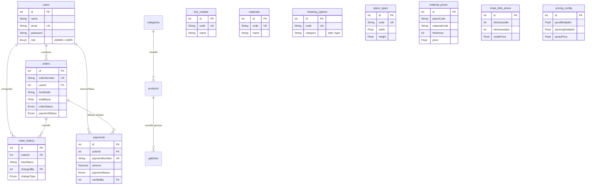

# Struktur Database Benua Kertas Apps

Dokumen ini berisi struktur tabel database terbaru untuk Benua Kertas Apps, lengkap dengan relasi antar tabel berdasarkan skema Prisma.

## Entity Relationship Diagram (ERD)

## Daftar Tabel & Deskripsi Fungsi

Database ini terbagi menjadi beberapa domain utama:

### 1. Manajemen Akses & Pengguna
- **`users`**: Tabel ini digunakan untuk menyimpan seluruh kredensial dan profil pengguna. Dibedakan menggunakan field `role` (`ADMIN` atau `USER`).

### 2. Transaksi & Custom Order (Inti Sistem)
- **`orders`**: Tabel pusat transaksi. Menyimpan riwayat pesanan box custom lengkap dengan detail: dimensi panjang/lebar/tinggi, bahan kertas, laminasi, dan breakdown hasil kalkulasi mesin (*harga kertas, cetak, pond, dll*).
- **`order_history`**: Tabel tracking untuk melacak pergerakan *Order Status* dan *Payment Status* dari waktu ke waktu (termasuk admin mana yang mengubah status).
- **`payments`**: Tabel khusus manajemen pembayaran. Menyimpan nominal, bukti transfer (`paymentProofUrl`), dan admin yang memverifikasi.

### 3. Master Data Kustomisasi (Dynamic Dropdowns)
Tabel-tabel ini menyimpan semua opsi yang ditampilkan di antarmuka Custom Order (sehingga admin dapat menambah/menghapus pilihan tanpa mengubah kode program).
- **`box_models`**: Daftar model kardus (misal: Earlock Box, Top Bottom Box).
- **`materials`**: Daftar jenis kertas dasar (misal: Duplex, Ivory).
- **`finishing_options`**: Opsi laminasi/finishing (misal: Sisi Luar, Glossy, Doff). Dibedakan berdasarkan kolom `category` menjadi dua tipe: `side` (Sisi) dan `type` (Tipe Laminasi).

### 4. Pricing Engine (Mesin Kalkulasi Harga v3)
Tabel-tabel referensi yang digunakan backend (terutama `pricingEngine.service.js`) untuk menghitung total biaya secara dinamis.
- **`plano_types`**: Ukuran-ukuran bahan baku plano yang tersedia di pabrik (contoh: 65x100, 79x109, 90x120) lengkap dengan ukuran *effective* setelah potong grip.
- **`material_prices`**: Tabel yang memetakan harga 1 lembar kertas plano. Sangat spesifik, merupakan gabungan dari `materialCode`, `planoCode`, dan ketebalan `thickness` (GSM).
- **`color_prices` & `cmyk_blok_prices`**: Matriks ongkos cetak (biaya plat, cetak mesin, dan drag). Dipisahkan berdasarkan rentang ketebalan kertas (`thicknessMin` & `thicknessMax`).
- **`pricing_config`**: Tabel konfigurasi *singleton* (hanya 1 baris) untuk variabel tetap seperti *multiplier* biaya pond (pisau cetak), biaya packing per-X barang, dan batas drag cetak.

### 5. Rekening & Produk Katalog Umum
- **`bank_accounts`**: Daftar rekening pembayaran yang aktif untuk ditampilkan ke pelanggan saat checkout.
- **`products`**, **`categories`**, **`galleries`**: Tabel standar E-Commerce untuk menyimpan dan menampilkan produk ready-stock/katalog yang sudah jadi.
- **`custom_orders`**: Form leads sederhana untuk user yang ingin memesan produk tipe lain di luar flow kalkulator box.

## Relasi Kunci Utama
1. **User ke Order**: 
   - `Order.userId` me-referensi ke `User.id` (1 user bisa memiliki banyak pesanan).
2. **Order ke Detail Riwayat**: 
   - `OrderHistory.orderId` dan `Payment.orderId` me-referensi ke `Order.id` (Cascade delete berlaku).
3. **Admin Actions Tracking**: 
   - `Payment.verifiedBy` dan `OrderHistory.changedBy` me-referensi ke `User.id` untuk audit sistem.
