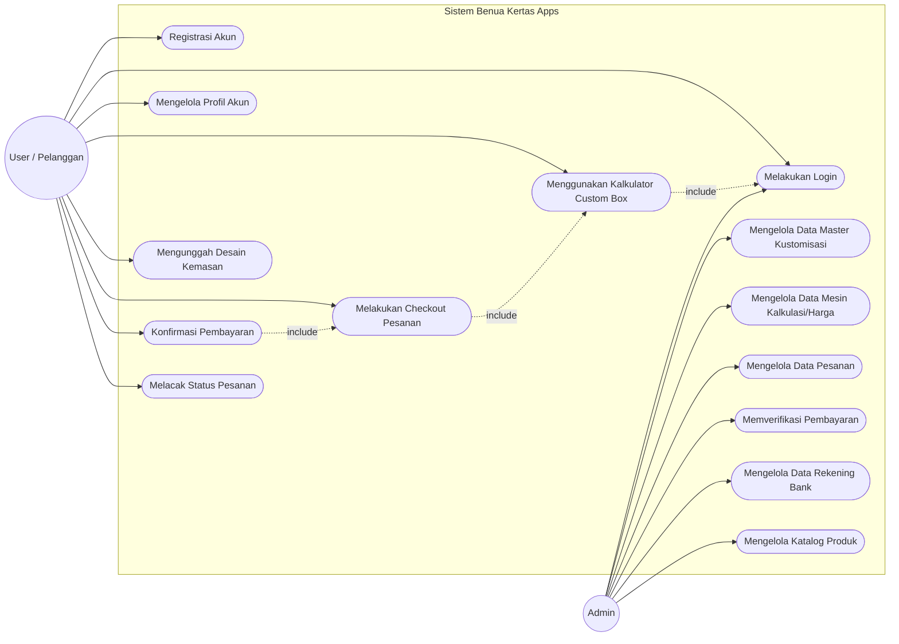

# Use Case Diagram & Deskripsi - Benua Kertas Apps

Dokumen ini menjelaskan diagram **Use Case** dari sistem Benua Kertas Apps beserta deskripsi setiap fungsionalitasnya berdasarkan analisa kebutuhan sistem.

## Diagram Use Case

---

## Deskripsi Skenario Use Case

### A. Kebutuhan User (Pelanggan)

| Nama Use Case | Deskripsi |
|---|---|
| **Registrasi Akun** | User yang belum memiliki akun dapat mendaftar dengan mengisi form registrasi (nama, email, password) untuk dapat bertransaksi. |
| **Melakukan Login** | User memasukkan email dan password untuk masuk ke dalam sistem dan mengakses fitur pesanan pribadi. |
| **Mengelola Profil Akun** | User dapat melihat dan mengubah informasi profil pribadi, mengubah password, serta mengatur data pengiriman. |
| **Menggunakan Kalkulator Custom Box** | Fitur utama di mana User memilih model box, mengatur ukuran dimensi (P x L x T), memilih material/kertas, dan memilih jenis laminasi. Sistem akan menghitung dan menampilkan estimasi harga secara _real-time_. |
| **Mengunggah Desain Kemasan** | User dapat mengunggah _file_ desain grafis untuk kemasan box yang dipesan (mendukung format gambar dan PDF standar). |
| **Melakukan Checkout Pesanan** | User menyelesaikan proses pesanan dengan menyetujui total harga dari kalkulator dan mengisi instruksi tambahan / catatan khusus sebelum dialihkan ke halaman instruksi pembayaran. |
| **Konfirmasi Pembayaran** | User mengunggah foto struk/bukti transfer setelah melakukan pembayaran melalui rekening bank yang disediakan oleh sistem. |
| **Melacak Status Pesanan** | User dapat melihat riwayat pesanan (Order History) dan memantau status pesanan (Misal: Menunggu Pembayaran, Sedang Diproduksi, Dikirim). |

### B. Kebutuhan Admin

| Nama Use Case | Deskripsi |
|---|---|
| **Melakukan Login** | Admin masuk ke *dashboard* khusus pengelola dengan akun admin. |
| **Mengelola Data Master Kustomisasi** | Admin melakukan operasi CRUD (Create, Read, Update, Delete) pada data yang akan muncul di dropdown kalkulator (Model Box, Daftar Material/Kertas, dan Opsi Finishing/Laminasi). |
| **Mengelola Data Mesin Kalkulasi/Harga** | Admin memperbarui tabel matriks harga sistem, seperti: Harga plano, harga ongkos cetak CMYK, harga pisau pond, dan nilai multiplier harga di *Pricing Config*. |
| **Mengelola Data Pesanan** | Admin melihat semua daftar pesanan masuk dari pelanggan, mengunduh _file_ desain, dan mengubah status progres pesanan (contoh: memindahkan pesanan dari "Menunggu" ke "Sedang Diproduksi" atau "Selesai"). |
| **Memverifikasi Pembayaran** | Admin mengecek bukti transfer yang diunggah pelanggan, lalu melakukan validasi (terima/tolak). Jika diterima, pesanan akan diteruskan ke antrean produksi. |
| **Mengelola Data Rekening Bank** | Admin mengatur daftar nomor rekening tujuan yang akan ditampilkan di halaman instruksi pembayaran pelanggan. |
| **Mengelola Katalog Produk** | Admin mengelola etalase produk jadi (_ready stock_) seperti menambah kategori produk baru, mengedit produk, atau menambah galeri foto. |
